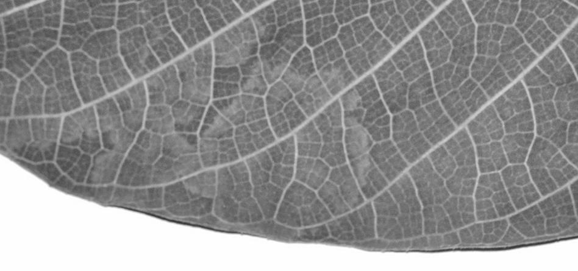
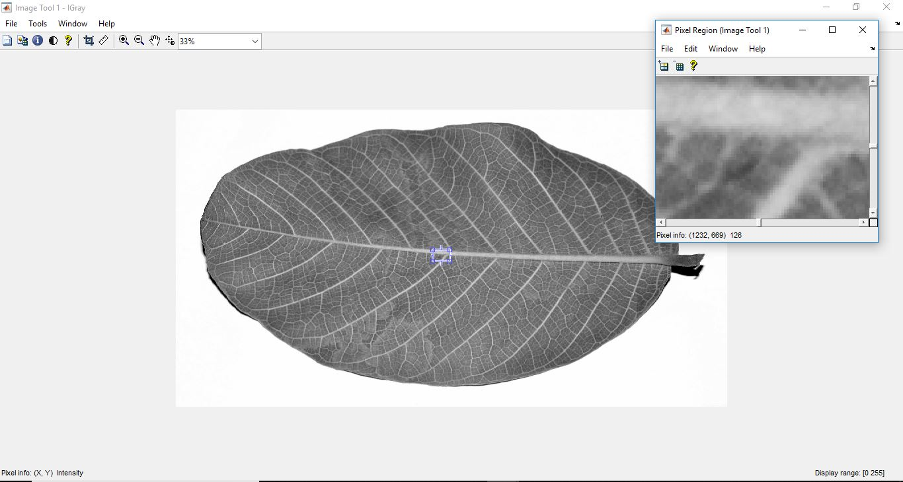

# MATLAB Leaf Vein Extraction: Advanced Digital Image Processing

A high-precision image processing pipeline developed in MATLAB for the automated extraction and segmentation of leaf venation patterns. This project leverages multi-stage spatial filtering and morphological analysis to isolate complex vein networks from botanical samples.



## Technical Overview

Leaf vein extraction is a critical task in plant phenotyping and botanical research. This implementation utilizes a sequence of non-linear filtering and gradient-based edge detection to segment the primary and secondary veins from the leaf lamina.

### Image Processing Pipeline

The algorithm follows a rigorous computational workflow:

1.  **Preprocessing & Enhancement**:
    *   **Grayscale Conversion**: Translates the RGB input into intensity space.
    *   **Histogram Equalization (HE)**: Enhances global contrast by distributing pixel intensities.
    *   **Intensity Adjustment**: Maps the intensity values to a new range to highlight subtle vein structures.

2.  **Segmentation**:
    *   **Binary Thresholding**: Separates the leaf structure from the background using global thresholding.

3.  **Feature Extraction**:
    *   **Canny Edge Detection**: Identifies high-gradient regions corresponding to vein boundaries.
    *   **Mathematical Morphology**: Applies dilation using a disk structuring element ($S$) to connect fragmented edges:
      $$A \oplus S = \{z \mid (\hat{S})_z \cap A \neq \emptyset\}$$

4.  **Refinement**:
    *   **Median Filtering**: Removes salt-and-pepper noise and small artifacts while preserving edge sharpness.
    *   **Overlay & Masking**: Final extraction is achieved by pixel-wise multiplication of the original intensity map and the refined binary mask.

## Algorithm Pseudo-code

```matlab
% Core Extraction Logic
IGray = rgb2gray(I);
IGray = histeq(IGray);
IGray = imadjust(IGray, [low_in high_in]);

% Edge and Morphological Analysis
IBin = im2bw(IGray, threshold);
Edges = edge(IBin, 'canny');
Dilation = imdilate(Edges, strel('disk', 1));
RefinedMask = medfilt2(Dilation, [3 3]);

% Result Extraction
Result = IGray .* imcomplement(RefinedMask);
```

## Results and Analysis

The implementation effectively extracts hierarchical vein structures across multiple leaf types (Mango, Jackfruit, etc.).

| Step | Output Type | Description |
| :--- | :--- | :--- |
| **Initial** | Grayscale Enhancement | High-contrast intensity map |
| **Intermediate** | Canny Edges | Spatial gradient distribution |
| **Final** | Extracted Network | Isolated vein geometry |



## Installation and Usage

### Prerequisites
*   MATLAB (R2018a or later recommended)
*   Image Processing Toolbox

### Execution
1.  Clone the repository:
    ```bash
    git clone https://github.com/adhishagc/matlab-image-processing-leaf-veins-madrid-extraction.git
    ```
2.  Open MATLAB and navigate to the project directory.
3.  Run the main script:
    ```matlab
    run('general.m')
    ```

## Project Structure
*   `general.m`: Primary execution script for general leaf samples.
*   `background_removal.m`: Modular function for HSV-based color thresholding.
*   `Results/`: Quantitative and qualitative output assets.
*   `References/`: Supporting documentation and research papers.

## About the Subject Matter
Automated venation extraction is foundational for plant classification (taxonomics) and understanding plant hydraulic architecture. By transforming biological images into mathematical graphs, researchers can quantify leaf symmetry, density, and connectivity.

---
*Optimized for Computational Botany and Computer Vision Research.*